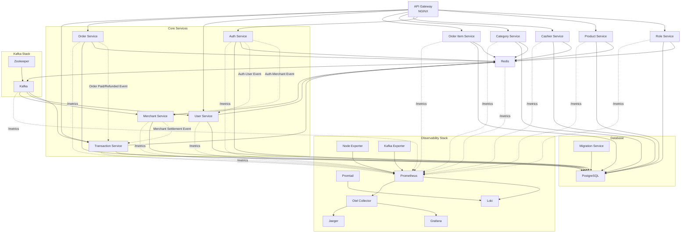
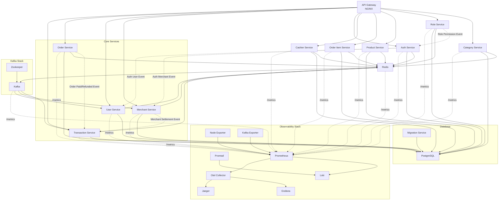

# Point of Sale (POS) Platform

The **Point of Sale Platform** is a comprehensive in-store sales system built on a **Distributed Modular Monolith** architecture. This approach combines the development simplicity of a monolith with the deployment flexibility of microservices.

The entire codebase is contained within a single, modular binary. However, at runtime, it is deployed as a distributed system where multiple instances of the same application run in different modes (e.g., as a 'user' service, 'product' service, or 'order' service). This unique structure simplifies dependency management and ensures code consistency, while still allowing for independent scaling and deployment of each service. Communication between these services is handled efficiently through high-performance gRPC APIs.


## 🛠️ Technologies Used
- 🚀 **gRPC** — Provides high-performance, strongly-typed APIs.
- 📡 **Kafka** — Used to publish balance-related events (e.g., after card creation).
- 📈 **Prometheus** — Collects metrics like request count and latency for each RPC method.
- 🛰️ **OpenTelemetry (OTel)** — Enables distributed tracing for observability.
- 🦫 **Go (Golang)** — Implementation language.
- 🌐 **Echo** — HTTP framework for Go.
- 🪵 **Zap Logger** — Structured logging for debugging and operations.
- 📦 **Sqlc** — SQL code generator for Go.
- 🧳 **Goose** — Database migration tool.
- 🐳 **Docker** — Containerization tool.
- 🧱 **Docker Compose** — Simplifies containerization for development and production environments.
- 🐘 **PostgreSQL** — Relational database for storing user data.
- 📃 **Swago** — API documentation generator.
- 🧭 **Zookeeper** — Distributed configuration management.
- 🔀 **Nginx** — Reverse proxy for HTTP traffic.
- 🔍 **Jaeger** — Distributed tracing for observability.
- 📊 **Grafana** — Monitoring and visualization tool.
- 🧪 **Postman** — API client for testing and debugging endpoints.
- ☸️ **Kubernetes** — Container orchestration platform for deployment, scaling, and management.
- 🧰 **Redis** — In-memory key-value store used for caching and fast data access.
- 📥 **Loki** — Log aggregation system for collecting and querying logs.
- 📤 **Promtail** — Log shipping agent that sends logs to Loki.
- 🔧 **OTel Collector** — Vendor-agnostic collector for receiving, processing, and exporting telemetry data (metrics, traces, logs).
- 🖥️ **Node Exporter** — Exposes system-level (host) metrics such as CPU, memory, disk, and network stats for Prometheus.

## Getting Started

Follow these instructions to get the project up and running on your local machine for development and testing purposes.

### Prerequisites

Make sure you have the following tools installed:
-   [Git](https://git-scm.com/)
-   [Go](https://go.dev/) (version 1.20+)
-   [Docker](https://www.docker.com/)
-   [Docker Compose](https://docs.docker.com/compose/)
-   [Make](https://www.gnu.org/software/make/)

### 1. Clone the Repository

```sh
git clone https://github.com/your-username/monolith-pointofsale-grpc.git
cd monolith-pointofsale-grpc
```

### 2. Environment Configuration

The project uses environment files for configuration. You'll need to create the necessary `.env` files.
*   Create a `.env` file in the root directory for general settings.
*   Create a `docker.env` file in `deployments/local/` for Docker-specific settings.

You can copy the example files if they exist, or create them from scratch.

### 3. Run the Application

The following commands will build the Docker images, start all services, and prepare the database.

**1. Build images and launch services:**
This command builds all service images and starts the entire infrastructure (including databases, Kafka, etc.) using Docker Compose.

```sh
make build-up
```

**2. Run Database Migrations:**
Once the containers are running, apply the database schema migrations.

```sh
make migrate
```

**3. Seed the Database (Optional):**
To populate the database with initial data for testing, run the seeder.

```sh
make seeder
```

The platform should now be fully operational. You can check the status of the running containers with `make ps`.

### Stopping the Application

To stop and remove all running containers, use the following command:

```sh
make down
```


## Architecture Overview

This platform is designed using a **Distributed Modular Monolith** architecture. This advanced style provides a unique balance, offering the streamlined development and simplified testing of a monolith while enabling the independent scaling and deployment of a microservices-based system.

The application is built as a single Go binary that contains all business logic modules. At runtime, multiple instances of this binary are deployed, with each instance configured to run a specific module (e.g., `auth`, `product`, `order`), effectively behaving like a separate service.

The system is designed to be deployed using containerization, with separate containers for each service. This allows for independent scaling and management of components in a production-like environment.

### Key Architectural Concepts:

*   **API Gateway**: A single entry point for all client requests. It routes traffic to the appropriate backend service, handles authentication, and provides a unified API.
*   **gRPC for Inter-Service Communication**: High-performance gRPC is used for communication between internal services, ensuring low latency and strongly-typed contracts.
*   **Asynchronous Messaging with Kafka**: Kafka is used for event-driven communication, decoupling services and improving resilience. For example, when a new card is created, a message is published to a Kafka topic, which is then consumed by the `email` service to update the balance.
*   **Centralized Observability**: The platform integrates a comprehensive observability stack:
    *   **Prometheus** for collecting metrics.
    *   **Jaeger** (via OpenTelemetry) for distributed tracing.
    *   **Loki** and **Promtail** for log aggregation.
    *   **Grafana** for visualization of metrics, traces, and logs.


### Deployment Archicture

#### Docker Environment
The Docker setup uses `docker-compose` to orchestrate all the services, databases, and tools needed for a complete local development environment.



#### Kubernetes Environment
The Kubernetes setup provides a scalable and resilient deployment. Each service runs in its own set of Pods, with Horizontal Pod Autoscalers (HPAs) for automatic scaling based on load.



### Core Components

*   **API Gateway**: The single entry point for all incoming HTTP traffic from clients. It is responsible for request validation, authentication, and routing requests to the appropriate downstream service module via gRPC.

*   **Service Modules**: The core business logic is encapsulated within distinct modules (e.g., `User`, `Product`, `Cart`, `Order`). Although packaged in one binary, they run as separate processes in the distributed environment, ensuring fault isolation and independent scalability.

*   **Communication**:
    *   **Synchronous (gRPC)**: High-performance, low-latency communication between the API Gateway and internal services is achieved using gRPC.
    *   **Asynchronous (Kafka)**: For decoupling services and handling event-driven workflows, the platform uses Kafka. For example, when an order is placed, an `order_created` event can be published, which other services can subscribe to without creating a direct dependency.

### Data and Caching

*   **Database (PostgreSQL)**: A central PostgreSQL database stores the core data for the application. Each service module is responsible for its own schema within this database.
*   **Caching (Redis)**: Redis is used as an in-memory cache to store frequently accessed data, reducing database load and improving response times.

### Observability

The platform features a comprehensive, production-grade observability stack built on the three pillars of observability:

*   **Logging (Loki & Promtail)**: All services generate structured logs. Promtail collects these logs and forwards them to Loki, a central log aggregation system, enabling powerful querying and analysis.
*   **Metrics (Prometheus & Grafana)**: Each service exposes detailed metrics (e.g., request rates, errors, latency). Prometheus scrapes and stores these metrics, while Grafana provides rich, interactive dashboards for visualization and monitoring.
*   **Tracing (Jaeger & OpenTelemetry)**: To understand the flow of requests across different services, the system is instrumented with OpenTelemetry for distributed tracing. Traces are sent to Jaeger, allowing developers to visualize call graphs, identify performance bottlenecks, and debug issues in a distributed environment.


## Makefile

This project comes with a `Makefile` containing various commands to facilitate development. Here are some available commands:

- `make migrate`: Run database migration
- `make migrate-down`: Rollback database migration
- `make generate-proto`: Generate Go code from `.proto` files
- `make generate-sql`: Generate Go code from SQL files
- `make generate-swagger`: Generate Swagger documentation
- `make seeder`: Populate database with initial data
- `make build-image`: Build Docker images for all services
- `make image-load`: Load Docker images to Minikube
- `make image-delete`: Delete Docker images from Minikube
- `make ps`: Display Docker container status
- `make up`: Run all services with Docker Compose
- `make down`: Stop all services running with Docker Compose
- `make build-up`: Build images and run all services with Docker Compose
- `make kube-start`: Start Minikube
- `make kube-up`: Run all services on Kubernetes
- `make kube-down`: Stop all services on Kubernetes
- `make kube-status`: Display status of pods, services, PVCs, and jobs on Kubernetes
- `make kube-tunnel`: Create tunnel to Minikube
- `make test-auth`: Run tests on the `auth` service