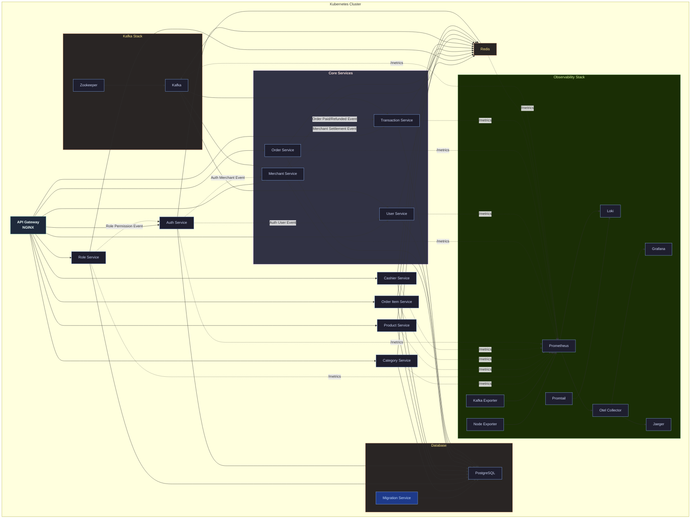

# ✨ Distributed Modular Monolith Point Of Sale

Proyek ini adalah **Implementasi Distributed Modular Monolith Point Of Sale** dari **Sistem Point of Sale (POS)**. Prinsip desain intinya adalah mempertahankan **pemisahan modular** (otentikasi, pengguna, merchant, produk, transaksi, dll.) sambil tetap di-deploy sebagai **monolit tunggal** untuk kesederhanaan operasional.

Tidak seperti monolit tradisional, implementasi ini mengadopsi **struktur modular dengan batasan domain yang jelas** dan memanfaatkan **gRPC** untuk komunikasi internal antar-layanan. Hal ini memungkinkan arsitektur untuk diskalakan seperti layanan mikro tetapi tanpa kompleksitas mengelola sistem yang sepenuhnya terdistribusi di awal. Seiring waktu, setiap modul dapat diekstraksi menjadi layanan mikro independennya sendiri jika diperlukan.

Sistem ini dirancang untuk menangani **operasi POS dalam skala besar**, termasuk otentikasi, akses berbasis peran, manajemen merchant, pelacakan inventaris, operasi kasir, pemrosesan pesanan, dan penanganan pembayaran.

Di tingkat infrastruktur, proyek ini terintegrasi dengan:

*   **PostgreSQL** untuk penyimpanan data relasional yang persisten.
*   **Redis** untuk caching dan manajemen sesi.
*   **Kafka** (dengan Zookeeper) untuk komunikasi berbasis peristiwa di seluruh modul.
*   **Tumpukan Observability** (Prometheus, Grafana, Loki, Jaeger, OpenTelemetry) untuk metrik, log, dan jejak penuh.

Deployment didukung di dua lingkungan:

*   **Docker Compose** untuk pengembangan lokal.
*   **Kubernetes** untuk lingkungan tingkat produksi yang dapat diskalakan dengan Horizontal Pod Autoscalers (HPA).

---

## 🎯 Fitur Utama

*   **🔐 Otentikasi & Manajemen Peran**

    *   Otentikasi pengguna berbasis JWT.
    *   Otorisasi berbasis peran (admin, merchant, kasir).
    *   Izin didefinisikan per modul.

*   **🏬 Manajemen Merchant & Kasir**

    *   Pendaftaran merchant dan pengaturan toko.
    *   Manajemen akun kasir di bawah setiap merchant.
    *   Peristiwa penyelesaian merchant terintegrasi dengan Layanan Transaksi.

*   **📦 Manajemen Inventaris & Produk**

    *   Operasi CRUD untuk produk dan kategori.
    *   Pelacakan stok dan harga.
    *   Akses berbasis peran untuk merchant dan kasir.

*   **🧾 Penanganan Pesanan & Transaksi**

    *   Pembuatan pesanan POS dan checkout.
    *   Integrasi dengan modul pembayaran dan transaksi.
    *   Penyelesaian berbasis peristiwa (dibayar/dikembalikan).

*   **🛒 Operasi Khusus POS**

    *   Item pesanan ditautkan ke produk dan kasir.
    *   Pembaruan cepat ke Redis untuk status sesi/keranjang waktu nyata.

*   **⚡ Komunikasi Terdistribusi**

    *   Layanan internal berkomunikasi melalui **gRPC**.
    *   Alur berbasis peristiwa melalui **topik Kafka**.
    *   API REST eksternal diekspos melalui **NGINX API Gateway**.

*   **📊 Observability & Pemantauan**

    *   Metrik diekspos melalui endpoint `/metrics`.
    *   Log dikumpulkan dengan Promtail → Loki.
    *   Metrik divisualisasikan melalui Prometheus → Grafana.
    *   Jejak dikumpulkan dengan OpenTelemetry → Jaeger.

---

## 🏗️ Arsitektur Deployment

### **1. Docker Compose (Pengembangan Lokal)**

*   Menggunakan `docker-compose` untuk mengatur **API Gateway, Layanan Inti, Layanan POS, PostgreSQL, Redis, Kafka, dan tumpukan Observability**.
*   Memastikan pengembang dapat menjalankan **seluruh tumpukan** secara lokal untuk pengujian integrasi.
*   Peristiwa layanan (auth-user, merchant-settlement, order-paid) diproses dalam **namespace monolitik** yang terdistribusi.

### **2. Kubernetes (Produksi)**

*   Setiap layanan berjalan di **Pod-nya sendiri**, dipisahkan oleh domain.
*   Redis, PostgreSQL, Kafka, dan Zookeeper di-deploy sebagai Pod infrastruktur stateful.
*   Tumpukan Observability berjalan sebagai DaemonSets/Deployments untuk log, metrik, dan jejak.
*   Horizontal Pod Autoscalers (HPA) secara otomatis menskalakan layanan seperti Pesanan, Transaksi, atau Merchant di bawah beban berat.
*   Kafka memastikan alur berbasis peristiwa tetap **terpisah** bahkan di bawah beban terdistribusi.
---


## 🛠️ Teknologi yang Digunakan
- 🚀 **gRPC** — Menyediakan API berkinerja tinggi dan bertipe kuat.
- 📡 **Kafka** — Digunakan untuk mempublikasikan peristiwa terkait saldo (misalnya, setelah pembuatan kartu).
- 📈 **Prometheus** — Mengumpulkan metrik seperti jumlah permintaan dan latensi untuk setiap metode RPC.
- 🛰️ **OpenTelemetry (OTel)** — Memungkinkan pelacakan terdistribusi untuk observability.
- 🦫 **Go (Golang)** — Bahasa implementasi.
- 🌐 **Echo** — Kerangka kerja HTTP untuk Go.
- 🪵 **Zap Logger** — Pencatatan terstruktur untuk debugging dan operasi.
- 📦 **Sqlc** — Generator kode SQL untuk Go.
- 🧳 **Goose** — Alat migrasi basis data.
- 🐳 **Docker** — Alat kontainerisasi.
- 🧱 **Docker Compose** — Menyederhanakan kontainerisasi untuk lingkungan pengembangan dan produksi.
- 🐘 **PostgreSQL** — Basis data relasional untuk menyimpan data pengguna.
- 📃 **Swago** — Generator dokumentasi API.
- 🧭 **Zookeeper** — Manajemen konfigurasi terdistribusi.
- 🔀 **Nginx** — Proksi terbalik untuk lalu lintas HTTP.
- 🔍 **Jaeger** — Pelacakan terdistribusi untuk observability.
- 📊 **Grafana** — Alat pemantauan dan visualisasi.
- 🧪 **Postman** — Klien API untuk menguji dan men-debug endpoint.
- ☸️ **Kubernetes** — Platform orkestrasi kontainer untuk deployment, penskalaan, dan manajemen.
- 🧰 **Redis** — Penyimpanan nilai-kunci dalam memori yang digunakan untuk caching dan akses data cepat.
- 📥 **Loki** — Sistem agregasi log untuk mengumpulkan dan menanyakan log.
- 📤 **Promtail** — Agen pengiriman log yang mengirim log ke Loki.
- 🔧 **OTel Collector** — Kolektor agnostik vendor untuk menerima, memproses, dan mengekspor data telemetri (metrik, jejak, log).
- 🖥️ **Node Exporter** — Mengekspos metrik tingkat sistem (host) seperti CPU, memori, disk, dan statistik jaringan untuk Prometheus.

## Memulai

Ikuti petunjuk ini untuk menjalankan proyek di mesin lokal Anda untuk tujuan pengembangan dan pengujian.

### Prasyarat

Pastikan Anda telah menginstal alat-alat berikut:
-   [Git](https://git-scm.com/)
-   [Go](https://go.dev/) (versi 1.20+)
-   [Docker](https://www.docker.com/)
-   [Docker Compose](https://docs.docker.com/compose/)
-   [Make](https://www.gnu.org/software/make/)

### 1. Klon Repositori

```sh
git clone https://github.com/your-username/monolith-pointofsale-grpc.git
cd monolith-pointofsale-grpc
```

### 2. Konfigurasi Lingkungan

Proyek ini menggunakan file lingkungan untuk konfigurasi. Anda perlu membuat file `.env` yang diperlukan.
*   Buat file `.env` di direktori root untuk pengaturan umum.
*   Buat file `docker.env` di `deployments/local/` untuk pengaturan khusus Docker.

Anda dapat menyalin file contoh jika ada, atau membuatnya dari awal.

### 3. Jalankan Aplikasi

Perintah berikut akan membangun image Docker, memulai semua layanan, dan menyiapkan basis data.

**1. Bangun image dan luncurkan layanan:**
Perintah ini membangun semua image layanan dan memulai seluruh infrastruktur (termasuk basis data, Kafka, dll.) menggunakan Docker Compose.

```sh
make build-up
```

**2. Jalankan Migrasi Basis Data:**
Setelah kontainer berjalan, terapkan migrasi skema basis data.

```sh
make migrate
```

**3. Isi Basis Data (Opsional):**
Untuk mengisi basis data dengan data awal untuk pengujian, jalankan seeder.

```sh
make seeder
```

Platform sekarang seharusnya sudah beroperasi penuh. Anda dapat memeriksa status kontainer yang berjalan dengan `make ps`.

### Menghentikan Aplikasi

Untuk menghentikan dan menghapus semua kontainer yang berjalan, gunakan perintah berikut:

```sh
make down
```


## Tinjauan Arsitektur

Platform ini dirancang menggunakan arsitektur **Monolit Modular Terdistribusi**. Gaya canggih ini memberikan keseimbangan unik, menawarkan pengembangan yang efisien dan pengujian yang disederhanakan dari sebuah monolit sambil memungkinkan penskalaan dan deployment independen dari sistem berbasis layanan mikro.

Aplikasi ini dibangun sebagai biner Go tunggal yang berisi semua modul logika bisnis. Saat runtime, beberapa instance dari biner ini di-deploy, dengan setiap instance dikonfigurasi untuk menjalankan modul tertentu (misalnya, `auth`, `product`, `order`), yang secara efektif berperilaku seperti layanan terpisah.

Sistem ini dirancang untuk di-deploy menggunakan kontainerisasi, dengan kontainer terpisah untuk setiap layanan. Hal ini memungkinkan penskalaan dan manajemen komponen secara independen di lingkungan seperti produksi.

### Konsep Arsitektur Utama:

*   **API Gateway**: Satu titik masuk untuk semua permintaan klien. Ini merutekan lalu lintas ke layanan backend yang sesuai, menangani otentikasi, dan menyediakan API terpadu.
*   **gRPC untuk Komunikasi Antar-Layanan**: gRPC berkinerja tinggi digunakan untuk komunikasi antara layanan internal, memastikan latensi rendah dan kontrak bertipe kuat.
*   **Pesan Asinkron dengan Kafka**: Kafka digunakan untuk komunikasi berbasis peristiwa, memisahkan layanan dan meningkatkan ketahanan. Misalnya, ketika kartu baru dibuat, sebuah pesan dipublikasikan ke topik Kafka, yang kemudian dikonsumsi oleh layanan `email` untuk memperbarui saldo.
*   **Observability Terpusat**: Platform ini mengintegrasikan tumpukan observability yang komprehensif:
    *   **Prometheus** untuk mengumpulkan metrik.
    *   **Jaeger** (melalui OpenTelemetry) untuk pelacakan terdistribusi.
    *   **Loki** dan **Promtail** untuk agregasi log.
    *   **Grafana** untuk visualisasi metrik, jejak, dan log.


### Arsitektur Deployment

#### Lingkungan Docker
Pengaturan Docker menggunakan `docker-compose` untuk mengatur semua layanan, basis data, dan alat yang diperlukan untuk lingkungan pengembangan lokal yang lengkap.

```mermaid
flowchart TD
    NGINX["API Gateway<br/>NGINX"]

    subgraph Core_Services["Core Services"]
        AuthService["Auth Service"]
        UserService["User Service"]
        MerchantService["Merchant Service"]
        OrderService["Order Service"]
        TransactionService["Transaction Service"]

        RoleService["Role Service"]
        ProductService["Product Service"]
        CashierService["Cashier Service"]
        CategoryService["Category Service"]
        OrderItemService["Order Item Service"]
    end

    %% Infra
    subgraph Database["Database"]
        MigrationService["Migration Service"]
        PostgreSQL["PostgreSQL"]
        MigrationService --> PostgreSQL
    end

    Redis["Redis"]

    subgraph KafkaStack["Kafka Stack"]
        Kafka["Kafka"]
        Zookeeper["Zookeeper"]
        Zookeeper --> Kafka
    end

    %% Observability
    subgraph Observability["Observability Stack"]
        Promtail["Promtail"]
        NodeExporter["Node Exporter"]
        KafkaExporter["Kafka Exporter"]
        Loki["Loki"]
        Prometheus["Prometheus"]
        OtelCollector["Otel Collector"]
        Grafana["Grafana"]
        Jaeger["Jaeger"]

        Promtail --> Loki
        NodeExporter --> Prometheus
        KafkaExporter --> Prometheus
        Prometheus --> Loki
        Prometheus --> OtelCollector
        OtelCollector --> Grafana
        OtelCollector --> Jaeger
    end

    %% Connections
    NGINX --> RoleService
    NGINX --> ProductService
    NGINX --> AuthService
    NGINX --> CashierService
    NGINX --> CategoryService
    NGINX --> OrderItemService
    NGINX --> UserService
    NGINX --> OrderService
    NGINX --> TransactionService

    %% Events
    AuthService -.->|Auth-Merchant Event| MerchantService
    AuthService -.->|Auth-User Event| UserService
    OrderService -.->|Order Paid/Refunded Event| TransactionService
    MerchantService -.->|Merchant Settlement Event| TransactionService

    %% Metrics & infra
    AuthService --> Redis
    UserService --> Redis
    MerchantService --> Redis
    OrderService --> Redis
    TransactionService --> Redis
    RoleService --> Redis
    ProductService --> Redis
    CashierService --> Redis
    CategoryService --> Redis
    OrderItemService --> Redis

    Redis --> Kafka
    Kafka --> TransactionService
    Kafka --> UserService
    Kafka --> MerchantService

    %% DB Connections
    AuthService --> PostgreSQL
    UserService --> PostgreSQL
    MerchantService --> PostgreSQL
    OrderService --> PostgreSQL
    TransactionService --> PostgreSQL
    ProductService --> PostgreSQL
    CategoryService --> PostgreSQL
    CashierService --> PostgreSQL
    OrderItemService --> PostgreSQL
    RoleService --> PostgreSQL

    %% Metrics Exposure
    AuthService -.->|/metrics| Prometheus
    UserService -.->|/metrics| Prometheus
    MerchantService -.->|/metrics| Prometheus
    OrderService -.->|/metrics| Prometheus
    TransactionService -.->|/metrics| Prometheus
    ProductService -.->|/metrics| Prometheus
    CategoryService -.->|/metrics| Prometheus
    CashierService -.->|/metrics| Prometheus
    OrderItemService -.->|/metrics| Prometheus
    RoleService -.->|/metrics| Prometheus
    Redis -.->|/metrics| Prometheus
    Kafka -.->|/metrics| Prometheus


    classDef default fill:#1e1e2e,stroke:#89b4fa,color:#cdd6f4,stroke-width:1px;
    classDef gateway fill:#1e293b,stroke:#94e2d5,color:#f0fdfa,font-weight:bold;
    classDef core fill:#313244,stroke:#cba6f7,color:#f5e0dc,font-weight:bold;
    classDef infra fill:#292524,stroke:#fab387,color:#fde68a;
    classDef obs fill:#1a2e05,stroke:#a6e3a1,color:#d9f99d;
    classDef misc fill:#1e3a8a,stroke:#89b4fa,color:#bfdbfe;

    %% Assign Classes
    class NGINX gateway;
    class Core_Services core;
    class Database,Redis,KafkaStack infra;
    class Observability obs;
    class MigrationService misc;
```



#### Lingkungan Kubernetes
Pengaturan Kubernetes menyediakan deployment yang dapat diskalakan dan tangguh. Setiap layanan berjalan dalam set Pod-nya sendiri, dengan Horizontal Pod Autoscalers (HPA) untuk penskalaan otomatis berdasarkan beban.



### Komponen Inti

*   **API Gateway**: Titik masuk tunggal untuk semua lalu lintas HTTP yang masuk dari klien. Ini bertanggung jawab untuk validasi permintaan, otentikasi, dan merutekan permintaan ke modul layanan hilir yang sesuai melalui gRPC.

*   **Modul Layanan**: Logika bisnis inti dienkapsulasi dalam modul-modul yang berbeda (misalnya, `User`, `Product`, `Cart`, `Order`). Meskipun dikemas dalam satu biner, mereka berjalan sebagai proses terpisah di lingkungan terdistribusi, memastikan isolasi kesalahan dan skalabilitas independen.

*   **Komunikasi**:
    *   **Sinkron (gRPC)**: Komunikasi berkinerja tinggi dan latensi rendah antara API Gateway dan layanan internal dicapai menggunakan gRPC.
    *   **Asinkron (Kafka)**: Untuk memisahkan layanan dan menangani alur kerja berbasis peristiwa, platform ini menggunakan Kafka. Misalnya, ketika pesanan dibuat, peristiwa `order_created` dapat dipublikasikan, yang dapat dilanggani oleh layanan lain tanpa membuat ketergantungan langsung.

### Data dan Caching

*   **Database (PostgreSQL)**: Database PostgreSQL pusat menyimpan data inti untuk aplikasi. Setiap modul layanan bertanggung jawab atas skemanya sendiri dalam database ini.
*   **Caching (Redis)**: Redis digunakan sebagai cache dalam memori untuk menyimpan data yang sering diakses, mengurangi beban database dan meningkatkan waktu respons.

### Observability

Platform ini memiliki tumpukan observability tingkat produksi yang komprehensif yang dibangun di atas tiga pilar observability:

*   **Logging (Loki & Promtail)**: Semua layanan menghasilkan log terstruktur. Promtail mengumpulkan log-log ini dan meneruskannya ke Loki, sistem agregasi log pusat, yang memungkinkan kueri dan analisis yang kuat.
*   **Metrik (Prometheus & Grafana)**: Setiap layanan mengekspos metrik terperinci (misalnya, tingkat permintaan, kesalahan, latensi). Prometheus mengikis dan menyimpan metrik-metrik ini, sementara Grafana menyediakan dasbor yang kaya dan interaktif untuk visualisasi dan pemantauan.
*   **Tracing (Jaeger & OpenTelemetry)**: Untuk memahami alur permintaan di berbagai layanan, sistem ini diinstrumentasi dengan OpenTelemetry untuk pelacakan terdistribusi. Jejak dikirim ke Jaeger, memungkinkan pengembang untuk memvisualisasikan grafik panggilan, mengidentifikasi hambatan kinerja, dan men-debug masalah di lingkungan terdistribusi.


## Makefile

Proyek ini dilengkapi dengan `Makefile` yang berisi berbagai perintah untuk memfasilitasi pengembangan. Berikut adalah beberapa perintah yang tersedia:

- `make migrate`: Menjalankan migrasi database
- `make migrate-down`: Mengembalikan migrasi database
- `make generate-proto`: Menghasilkan kode Go dari file `.proto`
- `make generate-sql`: Menghasilkan kode Go dari file SQL
- `make generate-swagger`: Menghasilkan dokumentasi Swagger
- `make seeder`: Mengisi database dengan data awal
- `make build-image`: Membangun image Docker untuk semua layanan
- `make image-load`: Memuat image Docker ke Minikube
- `make image-delete`: Menghapus image Docker dari Minikube
- `make ps`: Menampilkan status kontainer Docker
- `make up`: Menjalankan semua layanan dengan Docker Compose
- `make down`: Menghentikan semua layanan yang berjalan dengan Docker Compose
- `make build-up`: Membangun image dan menjalankan semua layanan dengan Docker Compose
- `make kube-start`: Memulai Minikube
- `make kube-up`: Menjalankan semua layanan di Kubernetes
- `make kube-down`: Menghentikan semua layanan di Kubernetes
- `make kube-status`: Menampilkan status pod, layanan, PVC, dan pekerjaan di Kubernetes
- `make kube-tunnel`: Membuat terowongan ke Minikube
- `make test-auth`: Menjalankan tes pada layanan `auth`
