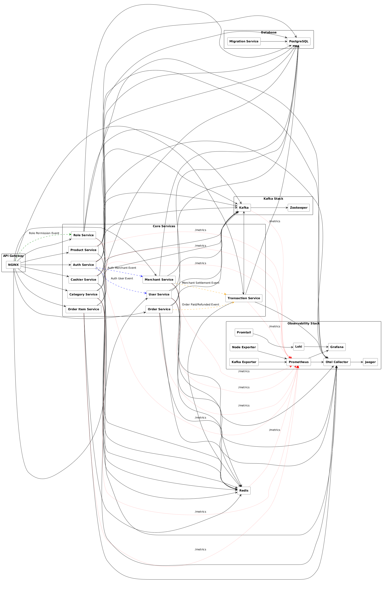
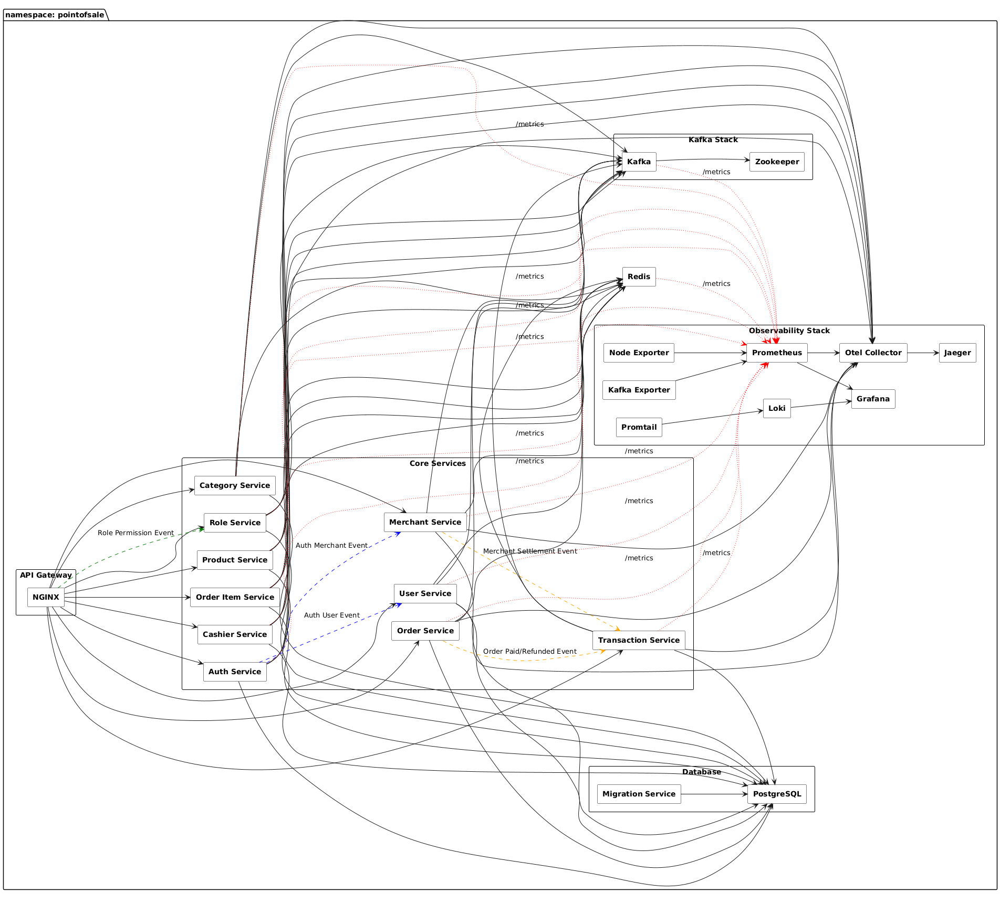

# Point of sale Platform

The **Point of sale Platform** is a robust, scalable, and secure integrated system designed to provide a comprehensive online shopping experience. Built using a monolithic architecture, all core functionalities—such as user management, product catalog, shopping cart, order processing, and merchant interactions—are consolidated within a single application. This approach simplifies development,  and deployment, ensuring a consistent and efficient delivery of Point of sale services within a unified environment.

## 🛠️ Technologies Used
- 🚀 **gRPC** — Provides high-performance, strongly-typed APIs.
- 📡 **Kafka** — Used to publish balance-related events (e.g., after card creation).
- 📈 **Prometheus** — Collects metrics like request count and latency for each RPC method.
- 🛰️ **OpenTelemetry (OTel)** — Enables distributed tracing for observability.
- 🦫 **Go (Golang)** — Implementation language.
- 🌐 **Echo** — HTTP framework for Go.
- 🪵 **Zap Logger** — Structured logging for debugging and operations.
- 📦 **Sqlc** — SQL code generator for Go.
- 🧳 **Goose** — Database migration tool.
- 🐳 **Docker** — Containerization tool.
- 🧱 **Docker Compose** — Simplifies containerization for development and production environments.
- 🐘 **PostgreSQL** — Relational database for storing user data.
- 📃 **Swago** — API documentation generator.
- 🧭 **Zookeeper** — Distributed configuration management.
- 🔀 **Nginx** — Reverse proxy for HTTP traffic.
- 🔍 **Jaeger** — Distributed tracing for observability.
- 📊 **Grafana** — Monitoring and visualization tool.
- 🧪 **Postman** — API client for testing and debugging endpoints.
- ☸️ **Kubernetes** — Container orchestration platform for deployment, scaling, and management.
- 🧰 **Redis** — In-memory key-value store used for caching and fast data access.
- 📥 **Loki** — Log aggregation system for collecting and querying logs.
- 📤 **Promtail** — Log shipping agent that sends logs to Loki.
- 🔧 **OTel Collector** — Vendor-agnostic collector for receiving, processing, and exporting telemetry data (metrics, traces, logs).
- 🖥️ **Node Exporter** — Exposes system-level (host) metrics such as CPU, memory, disk, and network stats for Prometheus.

## Architecture Ecommerce Platform

### Docker

### Kubernetes

----

> [!WARNING]
> Important Notice: This Point Of Sale Platform is currently under active development and is not production-ready. Some core features may be incomplete or subject to change. This project is intended for personal use and learning purposes only.