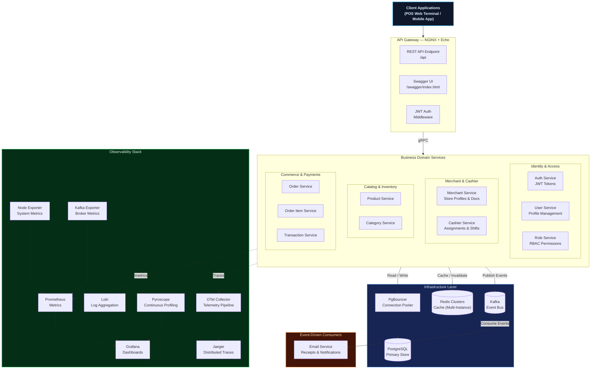
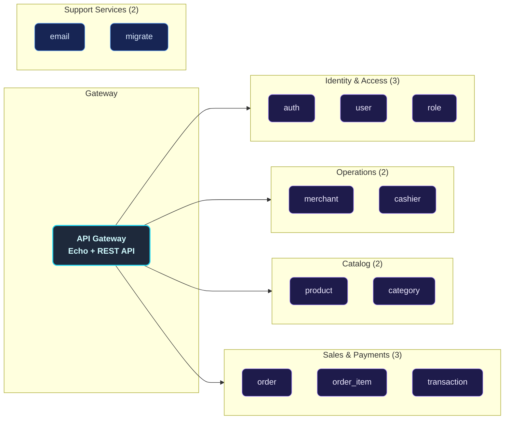
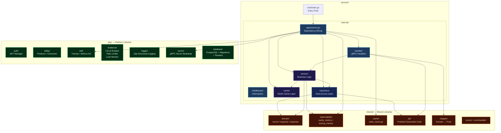
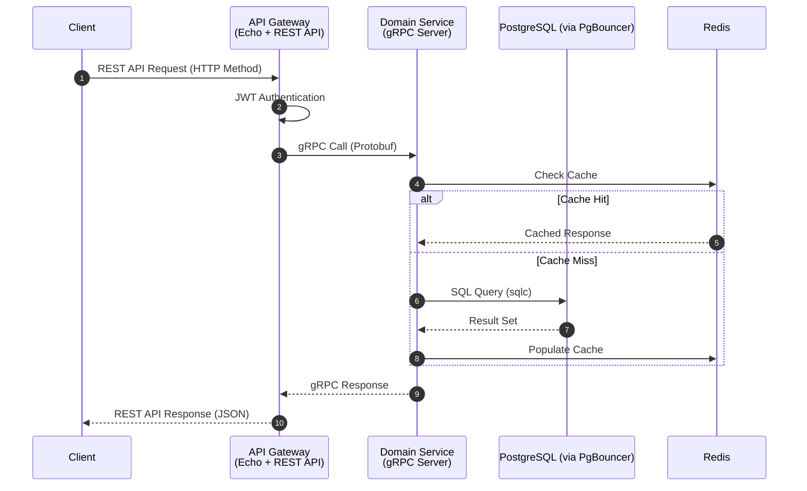
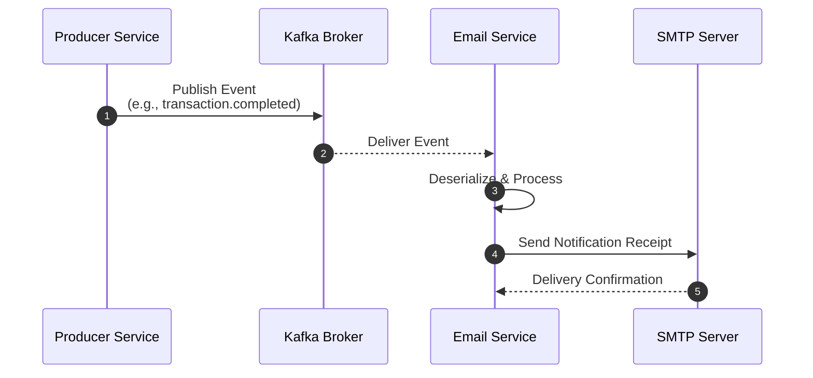
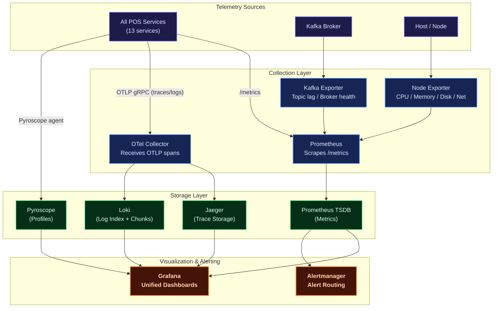
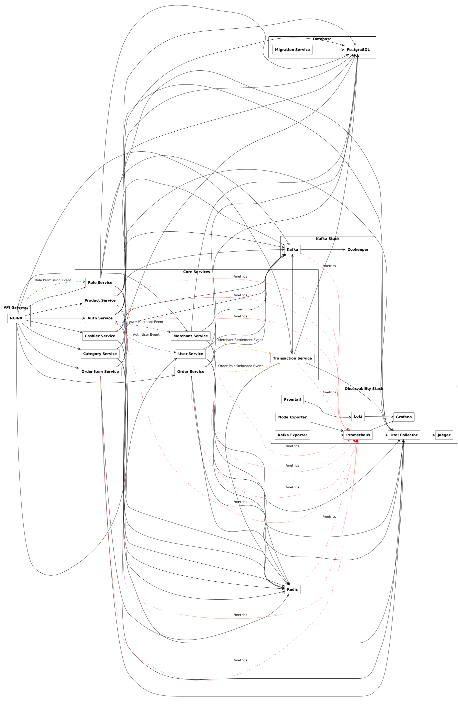

# Distributed Modular Monolith — Point of Sale (POS) Platform

A production-grade, **modular-monolith Point of Sale (POS) backend** built with **Go (Golang)**, designed around domain-driven service boundaries while retaining the operational simplicity of a single deployment unit. Each business domain — Users, Roles, Merchants, Cashiers, Products, Categories, Orders, Transactions — lives in its own self-contained module with a clean internal architecture. All modules ship as independently deployable containers that communicate via **gRPC** and asynchronous **Kafka** events.

The platform ships with a **full observability stack** (Prometheus, Grafana, Loki, Pyroscope, Jaeger, OpenTelemetry), **Redis caching** with instrumented metrics, **circuit-breaker & rate-limiting** resilience patterns, and first-class **Docker Compose** orchestrations.

---

## Key Features

| Domain | Capabilities |
|--------|-------------|
| **Auth & Users** | Registration, login, JWT access/refresh tokens, role-based authorization (RBAC), password reset flows |
| **Roles** | RBAC role creation, permission mappings, role-based authorization guards |
| **Merchants** | Merchant onboarding, store profile, and verification documents handling |
| **Cashiers** | Cashier registration, shift logging, store assignment, and performance tracking |
| **Categories** | Product taxonomy, CRUD operations, hierarchy management |
| **Products & Inventory** | Product listings, CRUD, stock monitoring, pricing, categorization, SKU/barcodes |
| **Orders & Checkout** | Cart checkout, sales transaction generation, order lifecycle, order-item decomposition |
| **Transactions** | Payment processing, transaction statuses, payment history, billing integration |
| **Notifications** | Kafka-driven email notification consumers for checkout receipts, account creation, password resets |
| **Observability** | Metrics (Prometheus + Grafana), Logging (Loki), Continuous Profiling (Pyroscope), Tracing (Jaeger + OpenTelemetry), System metrics (Node Exporter), Kafka metrics (Kafka Exporter) |
| **Deployment** | Multi-container Docker Compose for local development |

---

## Architecture Overview

The platform follows a **Distributed Modular Monolith** architecture — each module is a self-contained Go binary with its own clean-architecture internals, deployed as an independent container. An **API Gateway** (NGINX + Echo) provides a unified **REST API** entry point, translating HTTP REST requests into gRPC calls to downstream services. The API Gateway is fully documented with **Swagger**.

### Core Architecture Principles

- **Single Responsibility**: Each service owns its domain logic, data access, and caching layer.
- **Clean Architecture**: Every service follows `handler → service → repository` with clear dependency injection.
- **Event-Driven Decoupling**: Kafka enables asynchronous communication (e.g. sending receipt emails after transaction completion) without direct service dependencies.
- **Observability-First**: Every service is instrumented with OpenTelemetry traces, Prometheus metrics, Pyroscope profiling, and structured logging.
- **Resilience Patterns**: Built-in circuit breakers, request rate limiters, and load monitors in the shared `pkg/resilience` package.


```mermaid
graph TB
    classDef client fill:#0f172a,stroke:#38bdf8,color:#e0f2fe,stroke-width:2px,font-weight:bold
    classDef gateway fill:#1e293b,stroke:#22d3ee,color:#cffafe,stroke-width:2px,font-weight:bold
    classDef domain fill:#1e1b4b,stroke:#818cf8,color:#e0e7ff,stroke-width:1.5px
    classDef infra fill:#172554,stroke:#60a5fa,color:#dbeafe,stroke-width:1.5px
    classDef obs fill:#052e16,stroke:#4ade80,color:#dcfce7,stroke-width:1.5px
    classDef event fill:#431407,stroke:#fb923c,color:#fed7aa,stroke-width:1.5px

    Client["Client Applications<br/>(POS Web Terminal / Mobile App)"]:::client

    subgraph APIGateway["API Gateway — NGINX + Echo"]
        direction LR
        REST["REST API Endpoint<br/>/api"]
        Swagger["Swagger UI<br/>/swagger/index.html"]
        AuthMW["JWT Auth<br/>Middleware"]
    end
    class APIGateway gateway

    Client --> APIGateway

    subgraph BusinessServices["Business Domain Services"]
        direction TB

        subgraph IdentityDomain["Identity & Access"]
            AUTH["Auth Service<br/>JWT Tokens"]
            USER["User Service<br/>Profile Management"]
            ROLE["Role Service<br/>RBAC Permissions"]
        end

        subgraph MerchantDomain["Merchant & Cashier"]
            MERCH["Merchant Service<br/>Store Profiles & Docs"]
            CASHIER["Cashier Service<br/>Assignments & Shifts"]
        end

        subgraph CatalogDomain["Catalog & Inventory"]
            PROD["Product Service"]
            CAT["Category Service"]
        end

        subgraph CommerceDomain["Commerce & Payments"]
            ORDER["Order Service"]
            OITEM["Order Item Service"]
            TXN["Transaction Service"]
        end
    end
    class BusinessServices domain

    APIGateway -->|"gRPC"| BusinessServices

    subgraph Infrastructure["Infrastructure Layer"]
        direction LR
        PG[("PostgreSQL<br/>Primary Store")]
        PGBOUNCE["PgBouncer<br/>Connection Pooler"]
        REDIS[("Redis Clusters<br/>Cache (Multi-Instance)")]
        KAFKA[("Kafka<br/>Event Bus")]
    end
    class Infrastructure infra

    BusinessServices -->|"Read / Write"| PGBOUNCE
    PGBOUNCE --> PG
    BusinessServices -->|"Cache / Invalidate"| REDIS
    BusinessServices -->|"Publish Events"| KAFKA

    subgraph EventConsumers["Event-Driven Consumers"]
        EMAIL["Email Service<br/>Receipts & Notifications"]
    end
    class EventConsumers event

    KAFKA -->|"Consume Events"| EMAIL

    subgraph Observability["Observability Stack"]
        direction LR
        PROM["Prometheus<br/>Metrics"]
        LOKI["Loki<br/>Log Aggregation"]
        PYRO["Pyroscope<br/>Continuous Profiling"]
        JAEGER["Jaeger<br/>Distributed Traces"]
        GRAFANA["Grafana<br/>Dashboards"]
        OTEL["OTel Collector<br/>Telemetry Pipeline"]
        NODEX["Node Exporter<br/>System Metrics"]
        KAFKAX["Kafka Exporter<br/>Broker Metrics"]
    end
    class Observability obs

    BusinessServices -.->|"/metrics"| PROM
    BusinessServices -.->|"Traces"| OTEL
    OTEL -.-> JAEGER
    PROM -.-> GRAFANA
    LOKI -.-> GRAFANA
    PYRO -.-> GRAFANA
    NODEX -.-> PROM
    KAFKAX -.-> PROM
```

---

## Service Catalog

The platform is composed of **13 modular services** working in synergy with the supporting infrastructure:


```mermaid
graph LR
    classDef svc fill:#1e1b4b,stroke:#a78bfa,color:#ede9fe,stroke-width:1px,rx:8
    classDef gw fill:#1e293b,stroke:#22d3ee,color:#cffafe,stroke-width:2px,rx:8,font-weight:bold
    classDef support fill:#172554,stroke:#60a5fa,color:#dbeafe,stroke-width:1px,rx:8

    subgraph Gateway
        API["API Gateway<br/>Echo + REST API"]:::gw
    end

    subgraph Identity["Identity & Access (3)"]
        A1["auth"]:::svc
        A2["user"]:::svc
        A3["role"]:::svc
    end

    subgraph Operations["Operations (2)"]
        O1["merchant"]:::svc
        O2["cashier"]:::svc
    end

    subgraph Catalog["Catalog (2)"]
        C1["product"]:::svc
        C2["category"]:::svc
    end

    subgraph Sales["Sales & Payments (3)"]
        S1["order"]:::svc
        S2["order_item"]:::svc
        S3["transaction"]:::svc
    end

    subgraph Support["Support Services (2)"]
        SU1["email"]:::support
        SU2["migrate"]:::support
    end

    API --> Identity
    API --> Operations
    API --> Catalog
    API --> Sales
```

---

## Internal Service Architecture

Every business service follows a strict **Clean Architecture** pattern. Dependencies flow inward, keeping the core business logic free from infrastructure concerns.


```mermaid
graph TB
    classDef handler fill:#1e3a5f,stroke:#7dd3fc,color:#e0f2fe,stroke-width:1.5px
    classDef service fill:#1e1b4b,stroke:#a78bfa,color:#ede9fe,stroke-width:1.5px
    classDef repo fill:#172554,stroke:#60a5fa,color:#dbeafe,stroke-width:1.5px
    classDef infra fill:#052e16,stroke:#4ade80,color:#dcfce7,stroke-width:1.5px
    classDef shared fill:#431407,stroke:#fb923c,color:#fed7aa,stroke-width:1.5px

    subgraph Service["service/<name>/"]
        direction TB

        CMD["cmd/main.go<br/>Entry Point"]

        subgraph Internal["internal/"]
            direction TB
            APPS["apps/server.go<br/>Dependency Wiring"]:::handler
            HANDLER["handler/<br/>gRPC Handlers"]:::handler
            MW["middleware/<br/>Interceptors"]:::handler
            SVC["service/<br/>Business Logic"]:::service
            CACHE["cache/<br/>Redis Cache Layer"]:::service
            REPO["repository/<br/>Data Access (sqlc)"]:::repo
        end

        CMD --> APPS
        APPS --> HANDLER
        APPS --> SVC
        APPS --> CACHE
        APPS --> REPO
        HANDLER --> SVC
        SVC --> REPO
        SVC --> CACHE
    end

    subgraph SharedLibs["shared/ — Shared Libraries"]
        direction LR
        DOMAIN["domain/<br/>record / requests / response"]:::shared
        OBS["observability/<br/>cache_metrics / tracing_metrics"]:::shared
        CACHESHARED["cache/<br/>redis_cache.go"]:::shared
        PB["pb/<br/>Protobuf Generated Code"]:::shared
        MAPPER["mapper/<br/>Domain ↔ Proto"]:::shared
        ERRORS["errors/ + errorhandler/"]:::shared
    end

    subgraph PkgLibs["pkg/ — Platform Libraries"]
        direction LR
        PKGAUTH["auth/<br/>JWT Manager"]:::infra
        PKGKAFKA["kafka/<br/>Producer / Consumer"]:::infra
        PKGOTEL["otel/<br/>Tracing + Metrics Init"]:::infra
        PKGRES["resilience/<br/>Circuit Breaker<br/>Rate Limiter<br/>Load Monitor"]:::infra
        PKGLOG["logger/<br/>Zap Structured Logging"]:::infra
        PKGSRV["server/<br/>gRPC Server Bootstrap"]:::infra
        PKGDB["database/<br/>PostgreSQL + Migrations<br/>+ Seeders"]:::infra
    end

    REPO --> DOMAIN
    REPO --> PB
    SVC --> DOMAIN
    SVC --> OBS
    HANDLER --> PB
    HANDLER --> MAPPER
    APPS --> PKGSRV
    APPS --> PKGOTEL
    APPS --> CACHESHARED
    APPS --> OBS
```

---

## Data & Event Flow

### Synchronous Flow (gRPC)

All client-facing requests flow through the NGINX Gateway to the API Gateway, which forwards them over gRPC to the appropriate domain service.


```mermaid
sequenceDiagram
    autonumber
    participant C as Client
    participant GW as API Gateway<br/>(Echo + REST API)
    participant SVC as Domain Service<br/>(gRPC Server)
    participant DB as PostgreSQL (via PgBouncer)
    participant CACHE as Redis

    C->>GW: REST API Request (HTTP Method)
    GW->>GW: JWT Authentication
    GW->>SVC: gRPC Call (Protobuf)
    SVC->>CACHE: Check Cache
    alt Cache Hit
        CACHE-->>SVC: Cached Response
    else Cache Miss
        SVC->>DB: SQL Query (sqlc)
        DB-->>SVC: Result Set
        SVC->>CACHE: Populate Cache
    end
    SVC-->>GW: gRPC Response
    GW-->>C: REST API Response (JSON)
```

### Asynchronous Flow (Kafka Events)

Services publish domain events to Kafka topics. Downstream consumers (e.g. Email Service) react to these events asynchronously without coupling to the producer.


```mermaid
sequenceDiagram
    autonumber
    participant SVC as Producer Service
    participant K as Kafka Broker
    participant EMAIL as Email Service
    participant SMTP as SMTP Server

    SVC->>K: Publish Event<br/>(e.g., transaction.completed)
    K-->>EMAIL: Deliver Event
    EMAIL->>EMAIL: Deserialize & Process
    EMAIL->>SMTP: Send Notification Receipt
    SMTP-->>EMAIL: Delivery Confirmation
```

---

## Observability Architecture

The platform implements all **Three Pillars of Observability** (Metrics, Logs, and Traces) along with **Continuous Profiling** for maximum stability.


```mermaid
graph TB
    classDef service fill:#1e1b4b,stroke:#818cf8,color:#e0e7ff,stroke-width:1.5px
    classDef collector fill:#172554,stroke:#60a5fa,color:#dbeafe,stroke-width:1.5px
    classDef storage fill:#052e16,stroke:#4ade80,color:#dcfce7,stroke-width:1.5px
    classDef viz fill:#431407,stroke:#fb923c,color:#fed7aa,stroke-width:2px,font-weight:bold

    subgraph Sources["Telemetry Sources"]
        direction TB
        SVCS["All POS Services<br/>(13 services)"]:::service
        KAFKA_SRC["Kafka Broker"]:::service
        NODES["Host / Node"]:::service
    end

    subgraph Collectors["Collection Layer"]
        direction TB
        PROM["Prometheus<br/>Scrapes /metrics"]:::collector
        OTEL["OTel Collector<br/>Receives OTLP spans"]:::collector
        NODEX["Node Exporter<br/>CPU / Memory / Disk / Net"]:::collector
        KAFKAX["Kafka Exporter<br/>Topic lag / Broker health"]:::collector
    end

    subgraph Storage["Storage Layer"]
        direction TB
        PROM_TSDB["Prometheus TSDB<br/>(Metrics)"]:::storage
        LOKI_STORE["Loki<br/>(Log Index + Chunks)"]:::storage
        PYRO_STORE["Pyroscope<br/>(Profiles)"]:::storage
        JAEGER_STORE["Jaeger<br/>(Trace Storage)"]:::storage
    end

    subgraph Visualization["Visualization & Alerting"]
        GRAFANA["Grafana<br/>Unified Dashboards"]:::viz
        ALERTMGR["Alertmanager<br/>Alert Routing"]:::viz
    end

    SVCS -->|"/metrics"| PROM
    SVCS -->|"OTLP gRPC (traces/logs)"| OTEL
    SVCS -->|"Pyroscope agent"| PYRO_STORE
    NODES --> NODEX
    KAFKA_SRC --> KAFKAX

    NODEX --> PROM
    KAFKAX --> PROM
    PROM --> PROM_TSDB
    OTEL --> JAEGER_STORE
    OTEL --> LOKI_STORE

    PROM_TSDB --> GRAFANA
    LOKI_STORE --> GRAFANA
    PYRO_STORE --> GRAFANA
    JAEGER_STORE --> GRAFANA
    PROM_TSDB --> ALERTMGR
```

| Pillar | Tool | Purpose |
|--------|------|---------|
| **Metrics** | Prometheus + Grafana | Request rates, error rates, latency percentiles, cache hit ratios, system resource utilization |
| **Logging** | Loki + OpenTelemetry | Structured logs from all services, queryable inside Grafana |
| **Tracing** | Jaeger + OpenTelemetry | End-to-end distributed trace visualization, latency breakdown per service hop |
| **Continuous Profiling** | Pyroscope | Analysis of CPU, memory allocation, and concurrency performance over time |
| **Alerting** | Alertmanager | Alert routing and notification for metric threshold breaches |

---

## Deployment Architectures

### Docker Compose (Local Development)

The Docker Compose configuration provides a highly optimized local development environment where each modular service runs alongside its dedicated Redis cache, PostgreSQL, Kafka, and the observability stack.

<p align="center">
  
</p>

### Ports Mapping reference

| Service | gRPC Port | HTTP Port |
|---------|-----------|-----------|
| **apigateway** | — | `5000` |
| **auth** | `50051` | `8081` |
| **role** | `50052` | `8082` |
| **user** | `50053` | `8083` |
| **category** | `50054` | `8084` |
| **cashier** | `50055` | `8085` |
| **merchant** | `50056` | `8086` |
| **orderitem** | `50057` | `8087` |
| **order** | `50058` | `8088` |
| **product** | `50059` | `8089` |
| **transaction** | `50060` | `8090` |

### Infrastructure & Telemetry Ports

| Infrastructure / Telemetry | Port |
|----------------------------|------|
| **NGINX Reverse Proxy** | `80` |
| **PostgreSQL** | `5432` |
| **PgBouncer** | `6432` |
| **Redis (apigateway)** | `6379` |
| **Redis (auth)** | `6380` |
| **Redis (role)** | `6381` |
| **Redis (user)** | `6382` |
| **Redis (category)** | `6383` |
| **Redis (cashier)** | `6384` |
| **Redis (merchant)** | `6385` |
| **Redis (orderitem)** | `6386` |
| **Redis (order)** | `6387` |
| **Redis (product)** | `6388` |
| **Redis (transaction)** | `6389` |
| **Kafka Broker** | `9092` |
| **Grafana** | `3000` |
| **Prometheus** | `9090` |
| **Pyroscope** | `4040` |
| **Jaeger UI** | `16686` |
| **Loki** | `3100` |
| **Alertmanager** | `9093` |
| **Kafka Exporter** | `9308` |
| **Postgres Exporter** | `9187` |

---

## Technology Stack

| Category | Technology | Purpose |
|----------|-----------|---------|
| **Language** | Go (Golang) | High-performance, statically typed backend |
| **API Framework** | Echo | High-performance REST API framework |
| **API Documentation** | Swagger | Swagger REST API documentation |
| **RPC** | gRPC + Protobuf | High-performance inter-service communication |
| **Database** | PostgreSQL | Primary relational data store |
| **Connection Pooling** | PgBouncer | Lightweight connection pooler for PostgreSQL |
| **SQL Codegen** | sqlc | Type-safe SQL → Go code generation |
| **Migrations** | Goose | Database schema migration management |
| **Caching** | Redis | Multi-instance in-memory cache with instrumented metrics |
| **Messaging** | Apache Kafka | Asynchronous event-driven communication |
| **Auth** | JWT | Stateless authentication & authorization |
| **Logging** | Zap | High-performance structured logging |
| **Metrics** | Prometheus | Metric collection & alerting rules |
| **Tracing** | Jaeger + OpenTelemetry | Distributed trace collection & visualization |
| **Continuous Profiling** | Pyroscope | Continuous CPU & memory allocation profiling |
| **Log Aggregation** | Loki | Centralized log storage & shipping |
| **Dashboards** | Grafana | Unified metrics, logs, profiling, and trace dashboards |
| **Alerting** | Alertmanager | Alert routing & notification dispatch |
| **Telemetry Pipeline** | OTel Collector | Telemetry receive, process, and export |
| **Reverse Proxy** | NGINX | API routing, load balancing, TLS termination |
| **Task Runner** | Just | Command automation, compilation, and orchestration |
| **Resilience** | Circuit Breaker, Rate Limiter, Load Monitor | Fault tolerance patterns (`pkg/resilience`) |

---

## Getting Started

### Prerequisites

Ensure the following tools are installed on your system:

- [Git](https://git-scm.com/)
- [Go](https://go.dev/) (v1.20+)
- [Docker](https://www.docker.com/) & [Docker Compose](https://docs.docker.com/compose/)
- [Just](https://github.com/casey/just) (task runner)
- [Protobuf Compiler](https://grpc.io/docs/protoc-installation/) (for proto generation)

### 1. Clone the Repository

```sh
git clone https://github.com/MamangRust/monolith-pointofsale-grpc.git
cd monolith-pointofsale-grpc
```

### 2. Configure Environment

Create the required environment files:

```sh
# Root-level configuration
cp .env.example .env

# Docker-specific overrides
cp deployments/local/docker.env.example deployments/local/docker.env
```

Edit the `.env` and `docker.env` files to match your local setup.

### 3. Build & Launch (Docker Compose)

```sh
# Build all service images and start the full stack
just build-up

# Run database migrations
just migrate

# Seed the database with sample data
just seeder
```

### 4. Access Services

| Service | URL |
|---------|-----|
| **Swagger UI (via Nginx)** | `http://localhost:80/swagger/index.html` |
| **REST API Base Path (via Nginx)** | `http://localhost:80/api` |
| **Swagger UI (Direct)** | `http://localhost:5000/swagger/index.html` |
| **REST API Base Path (Direct)** | `http://localhost:5000/api` |
| **Grafana Dashboards** | `http://localhost:3000` (admin/admin) |
| **Pyroscope UI** | `http://localhost:4040` |
| **Prometheus UI** | `http://localhost:9090` |
| **Jaeger UI** | `http://localhost:16686` |
| **Loki (via Grafana)** | `http://localhost:3000` → Explore → Loki |

---

## Justfile Tasks

The project uses `just` as its task automation tool:

| Command | Description |
|---------|-------------|
| `just migrate` | Run database schema migrations (up) |
| `just migrate-down` | Rollback database migrations |
| `just seeder` | Seed database with mock POS data |
| `just generate-proto` | Regenerate Go code from `.proto` definitions |
| `just generate-sql` | Regenerate Go code from SQL queries (sqlc) |
| `just generate-swagger` | Regenerate Swagger API docs for the Gateway |
| `just build` | Compile all Go services into `bin/` |
| `just build-image` | Build Docker images for all services |
| `just up` | Start all docker compose containers |
| `just down` | Stop and tear down docker compose containers |
| `just build-up` | Rebuild images and start the stack |
| `just tidy-all` | Run `go mod tidy` in all Go service modules |

---

## Project Structure

```
monolith-pointofsale-grpc/
├── proto/                          # Protobuf definitions (12 domains)
├── shared/                         # Shared Go module
│   ├── pb/                         #   Generated protobuf Go code
│   ├── domain/                     #   Domain models (record/request/response)
│   ├── mapper/                     #   Domain ↔ Protobuf mappers
│   ├── cache/                      #   Redis cache abstraction
│   ├── observability/              #   Cache metrics + tracing metrics
│   ├── errors/                     #   Custom error types
│   └── errorhandler/               #   Error handling utilities
├── pkg/                            # Platform-level Go module
│   ├── auth/                       #   JWT token manager
│   ├── database/                   #   PostgreSQL connection + migrations + seeders
│   ├── kafka/                      #   Kafka producer/consumer wrapper
│   ├── otel/                       #   OpenTelemetry initialization
│   ├── resilience/                 #   Circuit breaker, rate limiter, load monitor
│   ├── logger/                     #   Zap structured logger
│   ├── server/                     #   gRPC server bootstrap
│   ├── middleware/                 #   Shared middleware
│   ├── email/                      #   Email client
│   ├── hash/                       #   Password hashing
│   ├── dotenv/                     #   Environment loader
│   ├── upload_image/               #   Image upload handler
│   ├── randomstring/               #   Random string generator
│   └── utils/                      #   General utilities
├── service/                        # All modular services
│   ├── apigateway/                 #   REST API Gateway (Echo + Swagger)
│   ├── auth/                       #   Authentication service
│   ├── user/                       #   User management
│   ├── role/                       #   RBAC role management
│   ├── cashier/                    #   Cashier management service
│   ├── category/                   #   Category management service
│   ├── merchant/                   #   Merchant core & documents
│   ├── product/                    #   Product management
│   ├── order/                      #   Order management
│   ├── order_item/                 #   Order item decomposition
│   ├── transaction/                #   Payment/transaction processing
│   ├── email/                      #   Email notification consumer
│   └── migrate/                    #   Database migration runner
├── deployments/
│   └── local/                      #   Docker Compose configuration
├── observability/                  #   Prometheus, Loki, OTel, Promtail configs
├── nginx/                          #   NGINX reverse proxy configuration
└── images/                         #   Documentation screenshots
```

---

## License

This project is open-sourced for educational and development purposes.

---

<p align="center">
  Built with Go, gRPC, and a passion for clean architecture.
</p>